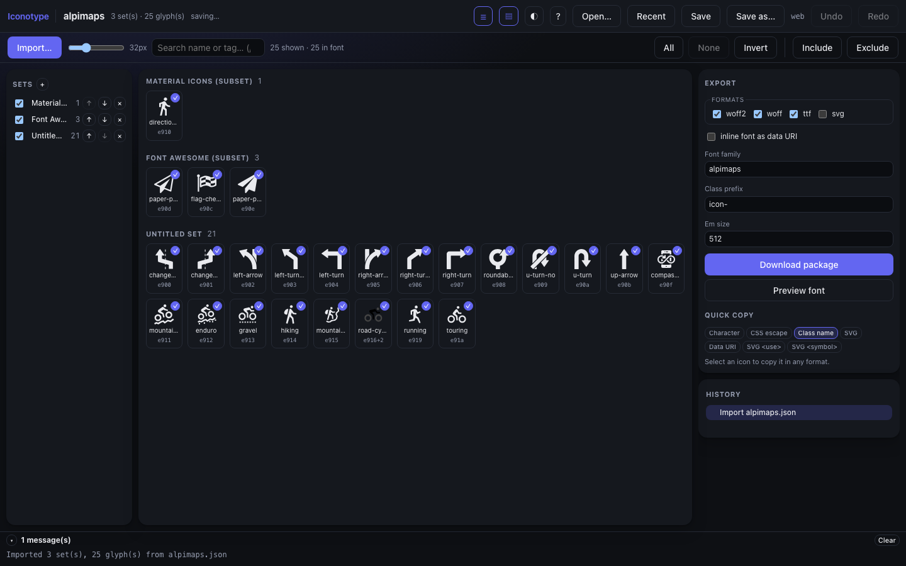
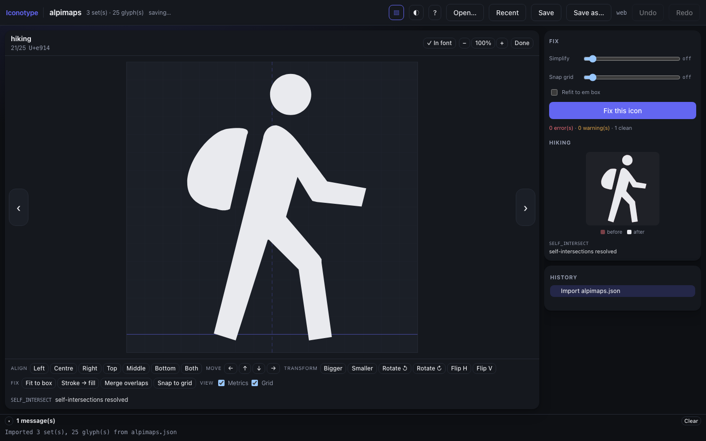

<div align="center">


# Iconotype

**Icon fonts, without the round trip.**

Build, fix and ship icon fonts — in the browser, on the desktop, or from the editor
you are already in. Imports IcoMoon projects. Open source, no account, no upload.

[](https://github.com/iconotype/iconotype/actions/workflows/ci.yml)
[](https://github.com/iconotype/iconotype/actions/workflows/pages.yml)
[](https://www.npmjs.com/package/@iconotype/cli)
[](LICENSE)

[**Web app**](https://iconotype.github.io/iconotype/app/) ·
[Website](https://iconotype.github.io/iconotype/) ·
[Desktop](https://github.com/iconotype/iconotype/releases/latest) ·
[VSCode](https://marketplace.visualstudio.com/items?itemName=iconotype.iconotype-vscode) ·
[Docs](docs/)



</div>

## Why

An icon font is a build artefact, but making one has always meant leaving the build:
upload SVGs to a website, click through a UI, download a zip, unpack it into your repo,
and hope nobody renamed anything. Do that twice and the codepoints have moved, so an
old cached stylesheet now renders a bicycle where a home icon used to be.

Iconotype keeps the whole thing in the repository. The project is a committed JSON file,
the build is deterministic, the codepoints are append-only and locked, and CI can fail a
pull request that would break a font already in production.

## Install

```bash
# CLI — the same build the apps run
npm install -g @iconotype/cli    # or: npx @iconotype/cli --help
```

Desktop builds for macOS, Windows and Linux are on the
[releases page](https://github.com/iconotype/iconotype/releases/latest). The VSCode
extension is on the
[marketplace](https://marketplace.visualstudio.com/items?itemName=iconotype.iconotype-vscode).
The [web app](https://iconotype.github.io/iconotype/app/) needs nothing at all.

## Quick start

Already have an IcoMoon project? Point at it and keep your codepoints:

```bash
npx @iconotype/cli init --input icomoon/project.json \
  --fonts-dir app/fonts --styles-dir app/css --style-kind scss-variables
```

That writes `<name>.iconotype.json` — commit it — and a `codepoints.lock`. Then, on a
laptop or a runner:

```bash
npx @iconotype/cli build --input app.iconotype.json
# built 27 glyph(s) → app/fonts/app.woff2, app/fonts/app.woff, app/fonts/app.ttf, app/css/_app.scss
```

Same input, same bytes, every time. In CI, add the gate:

```bash
npx @iconotype/cli diff --input app.iconotype.json --against origin/main   # non-zero if a codepoint moved
npx @iconotype/cli scan --input app.iconotype.json                         # which icons nothing references
```

## What it does

### Fixes SVGs so a font can hold them

Thirteen stages, each of which exists because artwork in the wild breaks fonts in a
specific way: inlined `<style>` rules, dereferenced `<use>`, shapes converted to paths,
transforms baked in, **strokes outlined into fills** (a font glyph has no stroke),
even-odd converted to non-zero, clips and masks applied, degenerate geometry removed.
Anything that cannot survive the trip is reported as a finding rather than silently
mangled — 31 codes, all of them documented in
[docs/04](docs/04-svg-normalization.md).

The pipeline is pinned by a 75-fixture visual regression corpus: every fixture is
rasterized before and after and compared as a coverage mask, so a "fix" that changes
what an icon looks like fails the build.

### Finds the icon instead of making you draw it

Search **236 open collections — 334,616 icons** from inside the app: Lucide, Google's
Material Symbols, Pictogrammers' MDI, Tabler, Phosphor, Font Awesome and 230 more, as
one index. Pick a few, and they arrive as ordinary glyphs — stroke sets like Lucide
outlined into fills on the way in, because a font glyph has no stroke.

Each collection lands in its own set carrying its own licence, and the credit follows
the artwork the rest of the way: onto the glyph, into the committed project file, and
into the header of the generated stylesheet — the one file that always ships next to
the font.

```bash
iconotype find chevron --prefixes lucide,tabler
iconotype add lucide:house mdi:cog --input app.iconotype.json
```

Only the search string and the icon names ever leave; point it at a self-hosted
[`iconify/api`](https://github.com/iconify/api) if even that is too much. Details in
[docs/21](docs/21-icon-library.md).

### An editor for what actually needs doing



Icons arrive already drawn; what they need is positional. Align to any edge, nudge,
scale, rotate, flip, fit to the em box, merge overlapping contours, snap to a grid,
outline strokes — on an em square with the baseline drawn, stepping through the whole
set with one key. Every action is a single labelled step in a history **tree**, so
undo-then-edit branches instead of destroying the future.

### Exports the whole package

`woff2` · `woff` · `ttf` · SVG font · CSS · SCSS · LESS · variables-only partials ·
CSS custom properties · JSON map · Flutter `IconData` · sprite sheet + CSS · PNGs ·
favicons · React and Vue components · a `.d.ts` union of every icon name.

Or point the project file at your build and skip the zip entirely: the export writes
`app/fonts/*` and `app/css/_icons.scss` in place, and identical bytes are not rewritten,
so a no-op export leaves the working tree clean.

### Treats codepoints as an API

Allocation is append-only from the Private Use Area and recorded in `codepoints.lock`.
Renaming an icon moves its **name**; the number stays. Removing one leaves its codepoint
reserved. This is the difference between a font you can ship twice and one you cannot —
and `iconotype diff` turns it into a check a reviewer never has to think about.

### Knows your codebase, from inside your editor

The VSCode extension is the reason this project exists rather than being another
generator. It reads the committed project file, so it knows your icons:

- **Autocompletion** on your prefix — `app-` offers your icons, with previews, and never
  offers one you excluded from the build
- **Inline previews** of the glyph next to every reference in your source
- **Diagnostics** for a typo'd or excluded icon, with a did-you-mean fix
- **Rename** an icon across the whole workspace, codepoint pinned
- **Usage** — what references each icon, and which icons nothing references
- **Export** straight into the paths the project file names, with a pending-changes
  indicator when the font on disk no longer matches
- `usagePrefixes` for when a build step rewrites references, so the prefix in your code
  and the prefix in the CSS can differ without any of the above getting confused

## How it is built

One core, three shells. Everything real lives in the packages; each app is a thin
adapter over a filesystem and a window.

```
packages/
  core-model/    document, ops + exact inverses, history tree, codepoint allocator
  core-svg/      the 13-stage fixer, 31 findings, headless paper.js
  core-font/     SVG font → TTF → WOFF/WOFF2, metrics, CSS generation
  core-io/       IcoMoon import/export (lossless), the .iconotype.json format
  core-export/   sprites, components, types, favicons, output layout, build stamps
  core-host/     the Host interface: memory, web (OPFS), tauri, vscode
  ui/            Svelte 5 components and stores, shared by all three shells
  cli/           iconotype init | build | lint | fix | diff | scan | find | add | info
apps/
  web/           → GitHub Pages, OPFS + File System Access
  desktop/       → Tauri v2, real files and native dialogs
  vscode/        → the extension and its webview
  site/          → the product page
```

Core packages are DOM-free — no `DOMParser`, no `document` — which is what lets the same
fixer run in a browser tab, a Node CLI and an extension host. Nothing in core calls
`Date.now()`, which is what makes builds byte-identical.

**Font writing is `svg2ttf`,** not `opentype.js`. The latter was tried first and
disqualified: it emits CFF/OTTO rather than glyf, stamps `head.modified` with the
current time (which quietly turned a determinism test green while producing different
bytes every run), and y-flips `Path.fromSVG` per glyph. The full evaluation is in
[docs/09](docs/09-libraries.md).

## Development

```bash
pnpm install
pnpm dev            # web app          pnpm dev:desktop   # tauri window (needs Rust)
pnpm dev:site       # product page     pnpm test          # 347 unit tests
pnpm check          # svelte-check + tsc                  pnpm test:vscode   # 52 in real VSCode
pnpm build          # every app
```

Every push runs the unit tests, the VSCode integration suite under xvfb, and a
`cargo check` of the desktop crate. `main` deploys the site and the web app; a `v*` tag
cuts a release — four desktop bundles, the `.vsix`, and the CLI to npm.

## Documentation

The [docs](docs/) are written as a record of the work, not a brochure: what was tried,
what broke, and why the code looks the way it does.

| | |
|---|---|
| [01](docs/01-vision-and-scope.md) Vision & scope | [02](docs/02-architecture.md) Architecture |
| [03](docs/03-features.md) Feature catalogue | [04](docs/04-svg-normalization.md) SVG normalization |
| [05](docs/05-font-pipeline.md) Font pipeline | [06](docs/06-import-export.md) Import / export |
| [07](docs/07-vscode-extension.md) VSCode extension | [08](docs/08-roadmap.md) Roadmap |
| [09](docs/09-libraries.md) Library evaluation | [10](docs/10-m0-scaffold.md)–[15](docs/15-m5-vscode.md) M0–M5 build log |
| [16](docs/16-m6-desktop.md) Desktop app | [17](docs/17-m7-glyph-editor.md) Glyph editor |
| [18](docs/18-ux-pass.md) The UX pass | [19](docs/19-website-and-releases.md) Website & releases |
| [20](docs/20-publishing.md) Publishing setup | [21](docs/21-icon-library.md) The icon library |

## Contributing

Issues and pull requests are welcome. `pnpm test && pnpm check` before opening one; if
you are changing the fixer, add a fixture to `fixtures/svg/` — the visual regression
suite will tell you whether your change altered anything it should not have.

## Licence

[MIT](LICENSE). Not affiliated with IcoMoon; imports its formats, does not use its
service.
